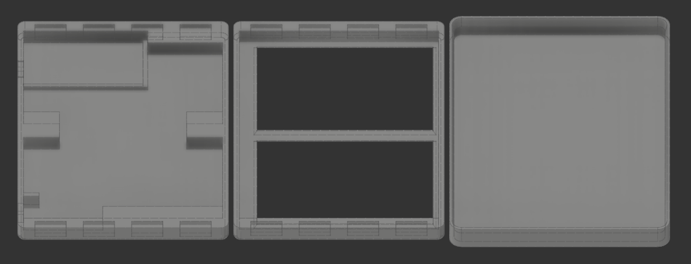

# rc-diy-remote-display-esp32

An ESP32 based dual screen remote display for RaceChrono over BLE

Dimensions :  88mm(W) x 121mm(H) x 16mm(D)

Components :
- Lolin32 lite w/ USB-C
- 2x 3.5 inch 480x320 IPS ILI9488 w/ shortened pcb (https://www.aliexpress.com/item/1005001999296476.html?spm=a2g0o.order_list.order_list_main.28.21ef1802BmLzHp)
- 2100 mah 654060 lipo (power draw is about 300ma so ~7hrs run time)
- SS12F15 Slide Switch
- 3D printed case 
